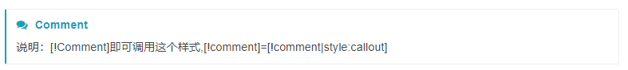
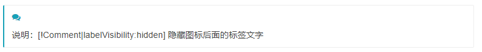
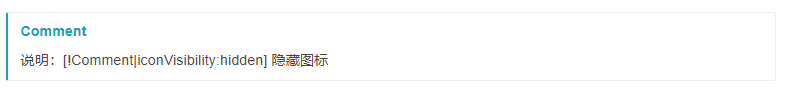
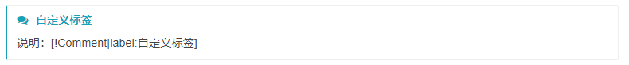
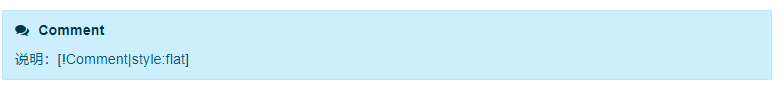
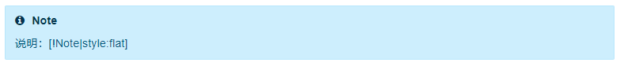
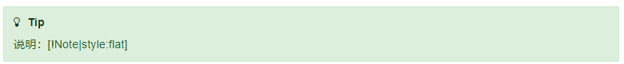
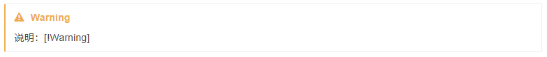
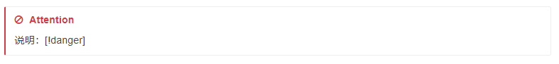
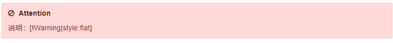

个人网站 ：https://cloudb.pub/
国内镜像站：https://xyz349925756.gitee.io/

https://cloudb.pub 是由Typora + Gitbook制作而成的。 

由于某些不可描述原因您可能不能访问，是因为github不能访问了。

翻墙相关的软件：https://github.com/stars/xyz349925756/lists/%E7%BF%BB%E5%A2%99

gitbook注释样式说明

1.注释命令

> [!Comment]
>
> 说明：[!Comment]即可调用这个样式,[!comment]=[!comment|style:callout]

2.隐藏标签

> [!Comment|labelVisibility:hidden]
>
> 说明：[!Comment|labelVisibility:hidden] 隐藏图标后面的标签文字

3.隐藏图标

> [!Comment|iconVisibility:hidden]
>
> 说明：[!Comment|iconVisibility:hidden] 隐藏图标

4.自定义标签

> [!Comment|label:自定义标签]
>
> 说明：[!Comment|label:自定义标签]

5.显示背景色

> [!Comment|style:flat]
>
> 说明：[!Comment|style:flat] 

其他样式也有上面的属性下面就不做介绍，至对比透明和背景色两个

6.通知

> [!Note]
>
> 说明：[!Note]

7.通知背景色

> [!Note|style:flat]
>
> 说明：[!Note|style:flat]

8.tip

> [!Tip]
>
> 说明：[!Tip]

9.tip背景色

> [!Tip|style:flat]
>
> 说明：[!Note|style:flat]

10.warning

> [!Warning]
>
> 说明：[!Warning]

11.warning背景色

> [!Warning|style:flat]
>
> 说明：[!Warning|style:flat]

12.危险

> [!danger]
>
> 说明：[!danger]

13.危险背景

> [!danger|style:flat]
>
> 说明：[!Warning|style:flat]

